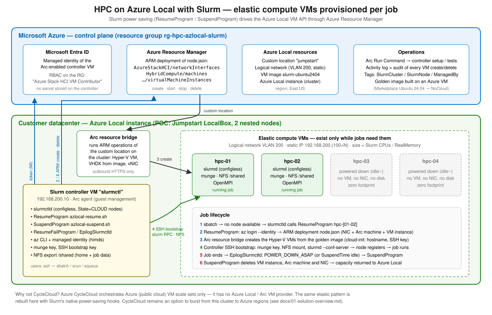

# HPC on Azure Local with Slurm — elastic compute VMs per job

Run HPC jobs on **Azure Local** with **Slurm**, where compute VMs are **created automatically when a
job needs them and deleted when the job ends** — the on-premises equivalent of what Azure CycleCloud does
in Azure.



## TL;DR

* **CycleCloud cannot drive Azure Local** (it only provisions Azure public-cloud VMs/VMSS). It remains useful
  to *burst* to Azure, not to create VMs on Azure Local.
* The solution uses **Slurm's native power-saving / cloud-node framework** (`State=CLOUD`,
  `ResumeProgram`, `SuspendProgram`) — the same mechanism CycleCloud uses — with programs that call the
  **Azure Local VM API through Azure Resource Manager** (Arc resource bridge / custom location).
* The Slurm controller authenticates with its **Arc managed identity** (no secret), scoped to one resource
  group with the built-in role **Azure Stack HCI VM Contributor**.
* Compute VMs are sized from `slurm.conf` (`CPUs`, `RealMemory`), boot from a **golden image** (Ubuntu
  24.04 + Slurm + munge + OpenMPI), join in **configless** mode, and are deleted (VM, Arc machine, NIC, disk)
  after the job (`EpilogSlurmctld` → `POWER_DOWN_ASAP`) or after `SuspendTime` idle.
* A working **POC** runs in subscription `7771d4f4-…`, resource group `rg-hpc-azlocal-slurm`, on a 2-node
  Azure Local instance deployed with Jumpstart LocalBox — see [POC results](docs/05-poc-results.md).

## Documentation

| Doc | Content |
|---|---|
| [01 – Solution overview](docs/01-solution-overview.md) | Requirement, CycleCloud assessment, options compared, decision |
| [02 – Architecture](docs/02-architecture.md) | Components, sequence diagrams, state machine, design decisions, security |
| [03 – Deployment guide](docs/03-deployment-guide.md) | Step-by-step deployment (POC and customer environment) |
| [04 – Operations](docs/04-operations.md) | Day-2 commands, troubleshooting, timeouts |
| [05 – POC results](docs/05-poc-results.md) | What was deployed, test evidence, measured provisioning/decommissioning times |
| [06 – Production considerations](docs/06-production-considerations.md) | HA, performance, GPU, identity, image pipeline, limitations |
| [07 – Sharing with OCR workloads](docs/07-coexistence-ocr-workloads.md) | "Qwen for OCR" clarification; using left-over capacity without preempting OCR (options A/B/C) |

## Repository layout

```text
infra/
  00-prereqs.ps1              resource providers, resource group, scoped policy exemption
  01-deploy-localbox.ps1      POC only: Azure Local via Jumpstart LocalBox
  01b-create-logical-network.ps1  POC only: VM logical network (LocalBox does not create one)
  02-build-golden-image.ps1   build Ubuntu+Slurm image on Azure, publish to Azure Local
  03-deploy-controller.ps1    controller VM, managed-identity RBAC, Slurm configuration (Arc Run Command)
  04-run-e2e.ps1              run the end-to-end test / ad-hoc commands on the controller
  99-teardown.ps1             remove compute VMs / Slurm / everything
  bicep/node.bicep            Azure Local NIC + Arc machine + VM instance (one Slurm node)
image/prepare-slurm-image.sh  golden image content + generalization for Azure Local (NoCloud)
slurm/
  bin/azlocal-resume.sh       ResumeProgram  - create/start VMs, bootstrap slurmd
  bin/azlocal-suspend.sh      SuspendProgram - delete/stop VMs
  bin/azlocal-resume-fail.sh  ResumeFailProgram - clean up nodes that did not join
  bin/azlocal-epilog-slurmctld.sh  per-job decommissioning (POWER_DOWN_ASAP)
  bin/azlocal-common.sh       shared helpers (auth, IDs, sizing, SSH)
  bin/node-bootstrap.sh       runs on a new VM: munge, NFS, configless slurmd
  controller/controller-setup.sh  configures the controller
  etc/slurm.conf.tpl          Slurm configuration (CLOUD nodes, power saving)
  etc/azlocal.conf.tpl        Azure Local target + lifecycle settings
  etc/node.json               compiled ARM template used on the controller
tests/                        hello + MPI jobs, e2e-test.sh
docs/                         documentation and diagrams
```

## Quick start

```powershell
$rg = 'rg-hpc-azlocal-slurm'
./infra/00-prereqs.ps1 -SubscriptionId <sub> -ResourceGroup $rg
./infra/01-deploy-localbox.ps1 -ResourceGroup $rg -TenantId <tenant> -AdminPassword (Read-Host -AsSecureString)  # POC only
./infra/01b-create-logical-network.ps1 -ResourceGroup $rg     # POC only, once the custom location is ready
./infra/02-build-golden-image.ps1 -ResourceGroup $rg          # after Azure Local is ready (Build + Publish + Cleanup)
./infra/03-deploy-controller.ps1 -ResourceGroup $rg
./infra/04-run-e2e.ps1 -ResourceGroup $rg
```

Then, on the controller:

```bash
sbatch -N 2 --wrap 'srun hostname'    # hpc-01/02 VMs are created, the job runs, the VMs are deleted
```
