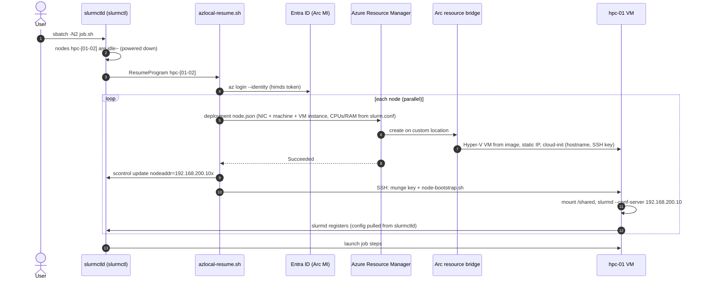
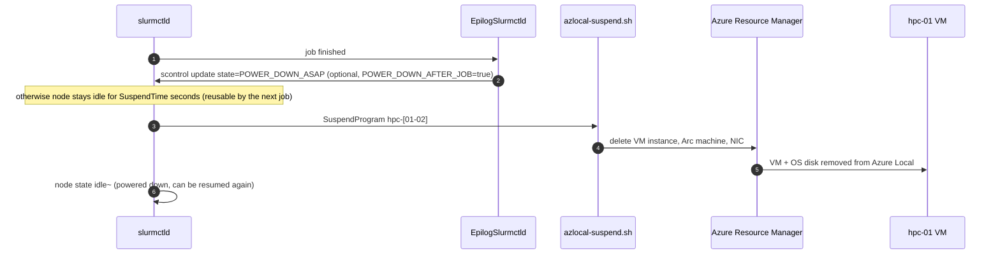
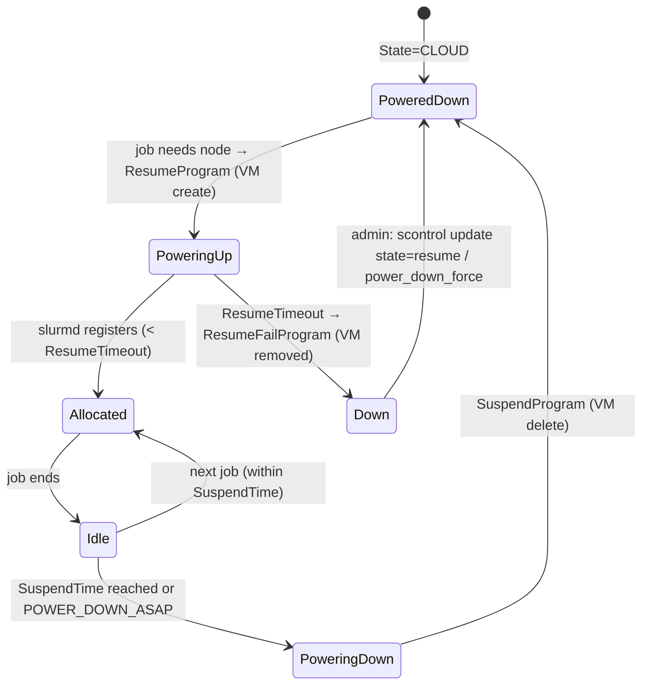

# 2. Architecture

## Components

| Component | Where | Role |
|---|---|---|
| Azure Local instance | Customer datacenter (POC: [Jumpstart LocalBox](https://jumpstart.azure.com/azure_jumpstart_localbox), 2 nested nodes) | Hyper-V failover cluster that runs every VM |
| Arc resource bridge + custom location | Azure Local | Executes ARM requests (`Microsoft.AzureStackHCI/*`) on the cluster |
| Logical network (`localbox-vm-lnet-vlan200`) | Azure Local | VLAN 200, `192.168.200.0/24`, static addressing |
| Golden image `slurm-ubuntu2404` | Azure Local gallery image | Ubuntu 24.04 + Slurm 23.11 + munge + OpenMPI + NFS + Azure CLI; generalized for cloud-init NoCloud |
| Slurm controller `slurmctl` | Azure Local VM, 4 vCPU / 8 GB, `192.168.200.10` | `slurmctld`, power-saving programs, NFS `/shared`, Arc agent (managed identity) |
| Compute nodes `hpc-01..04` | Azure Local VMs, created on demand | `slurmd` configless; 2 vCPU / 4 GB each in the POC (sized from `slurm.conf`) |
| Resource group `rg-hpc-azlocal-slurm` | Azure | All Azure Local resources; RBAC boundary for the controller identity |

## Provisioning sequence (job start)

## Decommissioning sequence (job end)

## Node state machine (Slurm view)

## Key design decisions

| Decision | Rationale |
|---|---|
| Use the **ARM / Azure Local VM API**, not Hyper-V directly | Supported management path for Azure Local VMs; RBAC, tags, Policy, audit; no Windows credentials on the Slurm controller |
| **ARM template** (`infra/bicep/node.bicep` → `slurm/etc/node.json`) instead of `az stack-hci-vm create` | Lets us set exact `processors` / `memoryMB` (the CLI exposes only preset sizes), create NIC+machine+VM in one idempotent call, and tag resources |
| **Managed identity of the Arc-enabled controller** | No secret on disk; role `Azure Stack HCI VM Contributor` scoped to the resource group (least privilege); service principal + certificate supported as fallback (`AZ_AUTH=sp`) |
| **Configless Slurm** (`enable_configless`, `slurmd --conf-server`) | Nodes carry no configuration; one image for all node shapes; config changes only on the controller |
| **SSH bootstrap** from the controller (not cloud-init user data) | The Azure Local VM instance API version used (`2024-01-01`) exposes no custom-data/user-data field; in addition the munge secret then never leaves the local network and never appears in ARM |
| **Deterministic static IPs** (`hpc-NN` → `.100+NN`) | Stable `/etc/hosts` for MPI peers and simple firewalling; pool allocation also supported (empty `NODE_IP_BASE`) |
| `SlurmctldParameters=cloud_reg_addrs,idle_on_node_suspend` + `CommunicationParameters=NoAddrCache` | Node address learned at registration; failed nodes become schedulable again after cleanup |
| `ResumeTimeout=1800` | VM creation on Azure Local copies the image VHDX; 30 min covers slow storage (see measured values in [05-poc-results.md](05-poc-results.md)) |
| Lifecycle **ephemeral** by default, **persistent** optional | Ephemeral = zero footprint when idle, clean node every time; persistent = faster start (VM start/stop), disks kept |
| Guest management (Arc agent) only on the controller | Needed for its managed identity and Run Command; compute nodes do not need it and boot faster without it |

## Security

* **Identity**: only the controller's system-assigned managed identity can create/delete VMs, and only in
  the resource group (`Azure Stack HCI VM Contributor`, which includes `customLocations/deploy/action`,
  `logicalNetworks/join/action`, `galleryImages/deploy/action`). The token endpoint (himds) is accessible
  to root and members of the `himds` group — only `slurm` is added.
* **Secrets**: munge key is generated on the controller and copied to nodes over SSH; the SSH bootstrap
  key belongs to `slurm` (`/etc/azlocal-slurm/ssh`, mode 0600). Neither is stored in Azure or in the image.
* **Network**: compute and controller are on the VLAN 200 logical network; only the controller needs
  outbound HTTPS to Azure (ARM, Entra ID, Arc). Compute nodes need no Internet access.
* **Audit**: every VM create/delete is an ARM operation (Activity Log, `Microsoft.Resources/deployments`
  history), tagged `ManagedBy=azlocal-slurm`, `SlurmNode=<name>`.

## Networking (POC)

| Network | CIDR | Use |
|---|---|---|
| LocalBox management | 192.168.1.0/24 | Azure Local nodes, DC/DNS (192.168.1.254) |
| VM logical network VLAN 200 | 192.168.200.0/24, gateway .1 | Controller `.10`, compute `.101`–`.104` |
